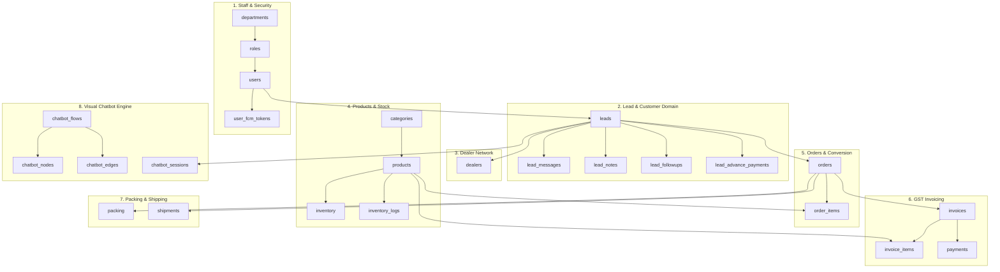

# SGB AGRO CRM - PRODUCT REQUIREMENT DOCUMENT (PRD) & MASTER SYSTEM BLUEPRINT

**Document Version:** 3.0.0  
**Document Status:** Enterprise Master Specification (Phase 1 Completed, Phases 2–5 Execution Roadmap)  
**Author:** Lead Enterprise System Architect & Engineering Team  
**Target Environment:** Hostinger Business Web Hosting / Cloud Infrastructure  
**Core Technologies:** Node.js (v18+), Express.js, MySQL 8.0, Vanilla JavaScript (ES6+), HTML5, CSS3, JWT, FCM  

---

## TABLE OF CONTENTS
1. [Executive Summary & Enterprise Context](#1-executive-summary--enterprise-context)
2. [System Architecture & Infrastructure Blueprint](#2-system-architecture--infrastructure-blueprint)
3. [Completed Phase 1: Core Systems, Security & Schema Audit](#3-completed-phase-1-core-systems-security--schema-audit)
4. [Completed Phase 1: Detailed Client Access Panels Specification](#4-completed-phase-1-detailed-client-access-panels-specification)
5. [Enterprise Phased Implementation Roadmap (Phases 1 to 5)](#5-enterprise-phased-implementation-roadmap-phases-1-to-5)
6. [Phase 2 Specification: Acefone Cloud Telephony & Calling Integration](#6-phase-2-specification-acefone-cloud-telephony--calling-integration)
7. [Phase 3 Specification: Zoho Books Financial & Billing Integration](#7-phase-3-specification-zoho-books-financial--billing-integration)
8. [Phase 4 Specification: Advanced Inventory, Raw Materials & BOM Tracking](#8-phase-4-specification-advanced-inventory-raw-materials--bom-tracking)
9. [Phase 5 Specification: Multi-Carrier Automated Shipping & Courier Tracking](#9-phase-5-specification-multi-carrier-automated-shipping--courier-tracking)
10. [Quality Assurance, Hostinger Deployment & SLA Protocols](#10-quality-assurance-hostinger-deployment--sla-protocols)

---

## 1. EXECUTIVE SUMMARY & ENTERPRISE CONTEXT

### 1.1 Business Background & Vision
**SGB Agro CRM** is a state-of-the-art, enterprise-grade Agricultural Customer Relationship Management and Enterprise Resource Planning (CRM/ERP) platform built for agro-chemical, fertilizer, seed, agricultural tool, and equipment manufacturers and distributors. 

Agricultural supply chains in India face unique operational challenges: multi-lingual customer bases (English, Kannada, Hindi), fragmented communication channels, manual lead handling, complex Indian GST tax structures (CGST, SGST, IGST), advance collection requirements, and high-volume parcel shipping. 

SGB Agro CRM unifies these operations into a single, high-performance web platform that automates customer acquisition via WhatsApp, manages multi-stage sales pipelines, enforces Policy/Permission-Based Access Control (PBAC), and coordinates warehouse logistics.

```
+---------------------------------------------------------------------------------------------------+
|                                      SGB AGRO CRM PLATFORM                                        |
+-------------------+-------------------+-------------------+-------------------+-------------------+
|  WHATSAPP AGRO    |  LEAD NURTURING & |   ORDER & STOCK   |   GST INVOICING   | LOGISTICS & PACK  |
|  CHATBOT ENGINE   |  DEALER PIPELINE  |   FULFILLMENT     |  & TAX ENGINE     | & DISPATCH TRACK  |
+-------------------+-------------------+-------------------+-------------------+-------------------+
```

### 1.2 Core System Capabilities (Phase 1 Implemented)
1. **Omnichannel WhatsApp Lead Capture & Visual Bot Engine**: Captures incoming inquiries via WhatsApp, executes visual decision-tree chatbot flows in multi-lingual modes, and registers leads into structured sales pipelines.
2. **End-to-End Sales Pipeline & Advance Payment Tracking**: Manages lead states (`new` -> `contacted` -> `advance_paid` -> `converted`/`lost`), tracks callback schedules, and validates uploaded UPI/bank receipts.
3. **GST-Compliant Invoicing Engine**: Computes CGST, SGST, and IGST based on state code matching, manages itemized HSN breakdowns, and generates GST invoices (`INV-YYYYMM-XXXX`).
4. **Logistics & Parcel Fulfillment Orchestration**: Manages warehouse packing inspection (box counts, weight kg) and parcel dispatch with AWB courier tracking.
5. **Multi-Role Access Control (PBAC/RBAC)**: Protects system endpoints using hybrid Policy & Role-Based Access Control across Admin, Sales, Billing, Packing, Shipping, and Dealer management panels.
6. **Hostinger Shared/Cloud Hosting Optimization**: Engineered specifically for high performance under memory caps (1–2GB RAM) and strict MySQL connection pooling limits (10 max connections).

---

## 2. SYSTEM ARCHITECTURE & INFRASTRUCTURE BLUEPRINT

### 2.1 3-Tier Enterprise Architectural Diagram

```
+--------------------------------------------------------------------------------------------------+
|                                    PRESENTATION LAYER (FRONTEND)                                 |
|  Vanilla JavaScript (ES6+) | HTML5 | Custom CSS3 | Single-Page Application (SPA) Engine           |
|  - Dynamic Role-Based Sidebar Navigation & Workspace Loader                                      |
|  - JWT Client-Side Storage & Auth Guard Pipeline                                                 |
|  - Visual Drag-and-Drop Chatbot Flow Builder & Canvas Engine                                     |
|  - Push Notifications & FCM Device Integration                                                   |
+------------------------------------------------+-------------------------------------------------+
                                                 | HTTP / REST APIs (JSON)
                                                 | Authorization: Bearer <JWT>
+------------------------------------------------v-------------------------------------------------+
|                                    APPLICATION LAYER (BACKEND)                                   |
|  Node.js (v18+) | Express.js Framework | PM2 Process Manager                                     |
|  - Controllers: Auth, Lead, Chatbot, Order, Billing, Logistics, User, Report, Schedule, etc.     |
|  - Services: FlowEngine.js (State Machine), whatsapp.service.js, fcm.service.js                 |
|  - Security Middleware: Helmet, Express-Rate-Limit, CORS, PBAC/RBAC Guards, bcryptjs             |
+------------------------------------------------+-------------------------------------------------+
                                                 | mysql2/promise Connection Pool (Limit: 10)
                                                 | UTF8MB4 Encoding (Multi-lingual & Emojis)
+------------------------------------------------v-------------------------------------------------+
|                                    DATA LAYER (DATABASE)                                         |
|  MySQL 8.0 Database Instance                                                                     |
|  - 40+ Relational Tables with Foreign Key Constraints & Cascading Logic                          |
|  - Transactional Integrity for Invoices, Stock Updates, Lead States, and Payment Logs             |
+--------------------------------------------------------------------------------------------------+
```

### 2.2 Technology Stack Matrix

| Layer | Technology | Version | Purpose & Rationale |
| :--- | :--- | :--- | :--- |
| **Backend Runtime** | Node.js | v18.x LTS | Asynchronous, event-driven I/O engine |
| **Web Framework** | Express.js | v4.18.2 | HTTP routing, middleware pipeline, REST API execution |
| **Database Engine** | MySQL | v8.0.x | Relational store with JSON column & transaction support |
| **DB Client Driver** | `mysql2/promise` | v3.6.0 | Non-blocking connection pooling with native Promises |
| **Authentication** | `jsonwebtoken` | v9.0.0 | Cryptographic stateless JWT token generation |
| **Password Security**| `bcryptjs` | v2.4.3 | Salted password hashing (10 rounds cost factor) |
| **Security Headers** | `helmet` | v7.0.0 | Hardens HTTP headers against XSS and clickjacking |
| **Rate Limiter** | `express-rate-limit` | v6.9.0 | DDoS and brute-force login protection |
| **File Uploads** | `multer` | v1.4.5 | Handles multipart uploads (payment receipts, bot media) |
| **Export Engine** | `exceljs` | v4.3.0 | Server-side Excel report generation |
| **Push Engine** | `firebase-admin` | v11.10.0 | Firebase Cloud Messaging (FCM) push notification engine |
| **Frontend Core** | Vanilla JS / HTML5 | ES6+ | Zero-dependency SPA engine for fast execution |

---

## 3. COMPLETED PHASE 1: CORE SYSTEMS, SECURITY & SCHEMA AUDIT

### 3.1 Relational Database Blueprint (40+ Tables Detailed)
The MySQL database consists of 40+ tables structured into 9 functional domains, configured with `utf8mb4` encoding to support multi-lingual strings and emojis.



#### Detailed Domain Breakdown:
1. **Departments & Staff**: `departments`, `roles`, `users`, `user_fcm_tokens` (PBAC roles, salted passwords, FCM push tokens).
2. **Leads & Customer Lifecycle**: `leads`, `lead_messages`, `lead_notes`, `lead_followups`, `lead_interest`, `lead_advance_payments`.
3. **Dealer Network**: `dealers` (Firm names, GSTINs, wholesale discounts, credit limits).
4. **Catalog & Inventory**: `categories`, `products`, `inventory`, `inventory_logs`, `product_sets`, `product_set_items`.
5. **Orders & Conversion Pipeline**: `orders`, `order_items` (Order state transitions, line items, advance payment credits).
6. **GST Invoicing Engine**: `invoices`, `invoice_items`, `payments`, `invoice_logs` (Intra vs Inter-state GST calculation, payment balance dues).
7. **Logistics & Packing**: `packing`, `shipments` (Parcel box counts, weights, courier names, AWB tracking numbers).
8. **Visual Chatbot Engine**: `chatbot_flows`, `chatbot_flow_versions`, `chatbot_nodes`, `chatbot_edges`, `chatbot_sessions`, `chatbot_executions`, `chatbot_media`, `chatbot_categories`, `chatbot_products`.
9. **Audit & Notifications**: `system_logs`, `campaigns`, `notifications`, `whatsapp_quick_replies`.

---

### 3.2 Security Architecture & PBAC/RBAC Access Engine

```
Client Request -> Helmet Hardening -> Rate Limiter -> JWT Verification -> PBAC Guard -> Controller
```

- **Stateless JWT Flow**: Signed using `jsonwebtoken` with 24-hour expiration containing `userId`, `email`, `roleId`, `departmentId`.
- **Hybrid PBAC/RBAC Engine**: Combines system roles with dynamic permission overrides:
  $$\text{Effective User Rights} = \text{Role.default\_permissions} \cup \text{User.permissions}$$
- **SQL Injection Defense**: 100% of queries use parameterized prepared statements (`pool.execute(sql, params)`).
- **Password Hardening**: All password hashes use `bcryptjs` with 10 salt rounds.
- **XSS & DDoS Protection**: `helmet()` configures HTTP security headers; `express-rate-limit` enforces rate limits on authentication APIs.

---

## 4. COMPLETED PHASE 1: DETAILED CLIENT ACCESS PANELS SPECIFICATION

SGB Agro CRM provides **6 dedicated role-based client access panels**, each customized for specific operational workflows.

```
+-----------------------------------------------------------------------------------------------+
|                                    SGB CRM PANEL NAVIGATION                                   |
+-------------------+---------------------------------------------------------------------------+
| DYNAMIC SIDEBAR   | TOP BAR (User Profile, Notifications, Quick Actions)                      |
|                   +---------------------------------------------------------------------------+
| - Admin Panel     |                                                                           |
| - Sales Panel     | ACTIVE PANEL WORKSPACE CONTAINER                                          |
| - WhatsApp Panel  | (Dynamically loaded HTML view + Javascript module execution context)     |
| - Billing Panel   |                                                                           |
| - Shipping Panel  |                                                                           |
| - Dealer Panel    |                                                                           |
+-------------------+---------------------------------------------------------------------------+
```

---

### 4.1 Super Admin & System Administration Panel
Designed for system administrators and business management to oversee operations, security, users, and platform configuration.

#### Panel Capabilities & Workspace UI:
- **User & Department Management**: Full CRUD operations on staff accounts (`users`), departments (`departments`), and roles (`roles`).
- **Granular PBAC Permission Editor**: Interactive matrix interface to configure role defaults and per-user permission overrides (`leads.create`, `billing.approve`, `inventory.edit`).
- **System Audit Log Viewer**: Searchable log table displaying user actions, HTTP endpoints accessed, IP addresses, and error tracebacks (`system_logs`).
- **Master Product & Category Catalog Manager**: Define SKUs, retail pricing, dealer rates, HSN tax codes, and GST rates.
- **Executive Analytics Dashboard**: High-level visual metrics on total lead conversion rate, daily order totals, monthly GST liability, and top-selling agro products.

---

### 4.2 Sales Manager & Sales Executive Workspace Panel
Engineered for sales teams to nurture WhatsApp inquiries, conduct follow-up callbacks, and convert prospects into orders.

#### Panel Capabilities & Workspace UI:
- **Leads Kanban & List Workspace**: Multi-view lead board organized by status (`new`, `assigned`, `contacted`, `callback`, `followup`, `interested`, `advance_paid`, `converted`, `lost`).
- **Lead Priority & Scoring Engine**: Color-coded lead temperature badges (`Hot` - red, `Warm` - orange, `Cold` - blue) calculated based on engagement frequency.
- **Calendar & Callback Scheduler**: Scheduling engine for sales reps with automated reminders for upcoming callbacks (`lead_followups`).
- **Advance Payment Collector**: Dedicated modal to record advance customer deposits via UPI, bank transfer, or cash, with instant receipt upload functionality (`lead_advance_payments`).
- **One-Click Order Conversion**: Automated tool to convert a qualified lead into an active sales order, carrying over customer details, address, and selected items into `orders` and `order_items`.

---

### 4.3 WhatsApp Live Chat & Communication Control Center Panel
Provides a centralized multi-agent live chat inbox and visual bot engine interface.

#### Panel Capabilities & Workspace UI:
- **Omnichannel Live Inbox**: Multi-agent shared inbox displaying incoming WhatsApp messages in real-time.
- **Visual Drag-and-Drop Chatbot Flow Builder**: Canvas interface (`chatbot-builder.js`) allowing non-technical managers to draw decision tree flows using visual nodes (`message`, `question`, `condition`, `action`, `media`, `product_catalog`).
- **Multi-Lingual Template Editor**: Configure dynamic response templates in English, Kannada, and Hindi.
- **Quick Reply Manager**: Pre-configured standard responses for fast rep replies (`whatsapp_quick_replies`).
- **Broadcast Campaign Manager**: Tool to schedule bulk WhatsApp broadcast messages to segmented lead lists (`campaigns`).

---

### 4.4 GST Billing & Financial Accounting Panel
Designed for billing managers and financial accountants to generate GST invoices and track payment collections.

#### Panel Capabilities & Workspace UI:
- **Automated GST Tax Invoicing**: Dynamic engine to create GST compliant tax invoices (`invoices`) from confirmed orders.
- **Intra-State vs. Inter-State Tax Resolver**: Automatically determines whether to apply CGST + SGST (intra-state) or IGST (inter-state) based on state code comparisons.
- **HSN Itemized Breakdown**: Generates itemized tax tables showing HSN codes (`3105`, `3808`), unit prices, discount deductions, and tax amounts.
- **Payment Collection Ledger**: Log partial or full payment receipts (`payments`) against open balance dues (`balance_due`).
- **Invoice PDF & Thermal Printing**: On-screen invoice view formatted for PDF download and thermal printing.

---

### 4.5 Packaging & Shipping Warehouse Operations Panel
Optimized for warehouse personnel to inspect, pack, and dispatch parcel shipments.

#### Panel Capabilities & Workspace UI:
- **Packing Inspection Workstation**: Warehouse queue showing confirmed orders awaiting packing (`packing`).
- **Parcel Dimension & Weight Logging**: Form to record physical box counts and total package weight in kg (`weight_kg`).
- **Shipment Dispatch Workstation**: Interface to assign courier providers (V-Trans, India Post, Professional Couriers, Shiprocket) and enter tracking numbers (`tracking_number`).
- **Courier Airway Bill (AWB) Logger**: Record AWB tracking identifiers and update shipment stages (`pending` -> `in_transit` -> `delivered` -> `rto`).
- **Warehouse Packing Audit Log**: Tracks which staff member packed each parcel to reduce shipping errors.

---

### 4.6 Dealer Management & Wholesale Portal Panel
Tailored for B2B agricultural dealer networks, wholesale distributors, and institutional bulk buyers.

#### Panel Capabilities & Workspace UI:
- **Dealer Directory & Account Profiles**: Directory storing dealer business names, GSTINs, business addresses, and primary contacts (`dealers`).
- **Wholesale Tier Pricing Engine**: Configurable dealer discount percentages (`discount_percentage`) applied automatically to catalog prices during order creation.
- **Credit Limit Authorization Manager**: Defines maximum credit limits (`credit_limit`) and tracks outstanding balance balances per dealer account.
- **Bulk Order Quick-Entry Matrix**: Order entry form designed for rapid bulk product ordering by SKU.
- **Dealer Account Statements**: Generates ledger statements showing historical orders, invoices, and payments.

---

## 5. ENTERPRISE PHASED IMPLEMENTATION ROADMAP (PHASES 1 TO 5)

| Development Phase | Phase Scope & Focus | Duration (Hours) | Duration (Weeks) | Key Deliverables & Output |
| :--- | :--- | :--- | :--- | :--- |
| **Phase 1 (Done)** | **Core CRM, Billing, Bot & Logistics** | ~700 Hours | Completed | 40+ DB Tables, 6 Access Panels, GST Invoicing, Visual Bot, Security |
| **Phase 2** | **Acefone Cloud Telephony Integration** | **672h – 700h** | **4 – 5 Weeks** | Click-to-Call, Inbound IVR, Call Recording, Telephony Analytics |
| **Phase 3** | **Zoho Books Financial Integration** | **672h – 700h** | **4 – 5 Weeks** | 2-Way Accounting Sync, Customer Ledger Sync, Automated Tax Sync |
| **Phase 4** | **Raw Materials, Stock & BOM Engine** | **672h – 700h** | **4 – 5 Weeks** | Multi-Warehouse Stock, Raw Materials, Manufacturing BOM, Purchase Orders |
| **Phase 5** | **Multi-Carrier Automated Shipping Sync** | **672h – 700h** | **4 – 5 Weeks** | Shiprocket/Delhivery API Sync, Auto AWB, Real-time Webhooks, RTO Management |

---

## 6. PHASE 2 SPECIFICATION: ACEFONE CLOUD TELEPHONY & CALLING INTEGRATION

### 6.1 Phase Overview & Business Context
- **Target Hours**: **672h – 700h (4 to 5 Weeks)**  
- **Scope Summary**: Integrates **Acefone Cloud Telephony API** into SGB Agro CRM, transforming lead management with integrated calling, IVR routing, automated call logging, call recording playback, and agent performance tracking.

```
+-----------------------------------------------------------------------------------------------+
|                                    PHASE 2 ARCHITECTURE: ACEFONE TELEPHONY                   |
+-------------------+-------------------+-------------------+-------------------+---------------+
| CLICK-TO-CALL     | INBOUND IVR       | REAL-TIME WEBHOOK | CALL RECORDING    | TELEPHONY     |
| SOFT-PHONE CTI    | ROUTING ENGINE    | CALL STATUS LOG   | STORAGE & PLAY    | ANALYTICS     |
+-------------------+-------------------+-------------------+-------------------+---------------+
```

### 6.2 10-Point Technical & Functional Development Scope (Minimum 10 Points)

1. **Acefone REST API & CTI Softphone Integration**: Build backend service (`acefone.service.js`) and frontend CTI widget to establish authentication handshakes and manage live phone calls directly inside the web app workspace.
2. **One-Click Dialing (Click-to-Call)**: Add single-click phone call buttons across Lead lists, Customer profiles, and Dealer directories, triggering outbound calls via Acefone API without manual dialing.
3. **Inbound Call IVR & Smart Agent Routing**: Configure Acefone inbound call routing webhooks to identify calling numbers against database records (`leads`, `dealers`) and route calls directly to assigned sales reps.
4. **Real-time Call Status Webhook Receiver**: Implement high-throughput webhook handler (`/api/telephony/webhook`) to listen for call events (`call_started`, `ringing`, `answered`, `completed`, `missed`, `busy`) and update database records instantly.
5. **Automated Call Recording Sync & Cloud Storage**: Securely store Acefone call recording URLs, download audio files, and embed an HTML5 audio player inside lead timeline views for call quality auditing.
6. **Automated Lead Activity Timeline Logging**: Automatically write call logs (`call_duration`, `call_type`, `agent_id`, `call_status`, `recording_url`) into `lead_messages` and activity feeds.
7. **Missed Call Auto-Responder & WhatsApp Trigger**: Detect missed calls during or after office hours and automatically trigger instant WhatsApp follow-up messages via `FlowEngine.js`.
8. **Telephony Analytics & Agent Call Metrics Dashboard**: Build reports detailing call counts, average handle time (AHT), call connect rates, first call resolution (FCR), and agent idle time.
9. **Outbound Campaign Auto-Dialer Integration**: Implement power-dialer capability for sales teams to automatically sequence outbound follow-up calls to scheduled lead callback lists (`lead_followups`).
10. **Comprehensive Telephony QA, API Testing & Bug Fixing**: Conduct load testing on webhooks, test network failure recovery, conduct automated Jest integration tests, and execute a 1-week stabilization bug-fix sprint.

---

## 7. PHASE 3 SPECIFICATION: ZOHO BOOKS FINANCIAL & BILLING INTEGRATION

### 7.1 Phase Overview & Business Context
- **Target Hours**: **672h – 700h (4 to 5 Weeks)**  
- **Scope Summary**: Establishes seamless 2-way synchronization between SGB Agro CRM's billing engine and **Zoho Books**, ensuring unified accounting, general ledger balance, tax compliance, and automated financial reporting.

```
+-----------------------------------------------------------------------------------------------+
|                                    PHASE 3 ARCHITECTURE: ZOHO BOOKS SYNC                      |
+-------------------+-------------------+-------------------+-------------------+---------------+
| ZOHO OAUTH 2.0    | 2-WAY CUSTOMER &  | AUTOMATED INVOICE | TAX & HSN CODE    | PAYMENT &     |
| TOKEN ENGINE      | DEALER SYNC       | PUSH ENGINE       | MAPPING MATRIX    | RECONCILIATION|
+-------------------+-------------------+-------------------+-------------------+---------------+
```

### 7.2 10-Point Technical & Functional Development Scope (Minimum 10 Points)

1. **Zoho OAuth 2.0 Authentication & Token Engine**: Implement secure OAuth 2.0 authorization code flow (`zoho.service.js`) with dynamic refresh token rotation to maintain persistent API connections to Zoho Books.
2. **2-Way Customer & Dealer Ledger Synchronization**: Synchronize customer profiles (`leads`) and wholesale dealers (`dealers`) with Zoho Contacts, mapping GSTINs, addresses, and credit limits.
3. **Automated GST Invoice Push to Zoho Books**: Automatically push generated tax invoices (`invoices`) to Zoho Books upon order confirmation, ensuring synchronized invoice numbers and line item details.
4. **Automated Tax Code & HSN Breakdown Mapping**: Map internal GST tax calculations (CGST, SGST, IGST) and HSN codes (`3105`, `3808`) directly to corresponding Zoho Tax Authority rules.
5. **Payment Collection & Receipt Sync**: Push advance deposits (`lead_advance_payments`) and final balance collections (`payments`) to Zoho Books Customer Payments, maintaining consistent ledger balances.
6. **Credit Note & Order Cancellation Handling**: Synchronize order cancellations and customer refunds by creating linked Credit Notes in Zoho Books.
7. **Chart of Accounts & General Ledger Alignment**: Map sales categories (Fertilizers, Bio-Pesticides, Seeds) to specific Revenue Accounts in Zoho Books Chart of Accounts.
8. **Real-time Inventory Valuation & Stock Sync**: Align inventory asset valuation by syncing item stock changes with Zoho Inventory / Zoho Books stock tracking modules.
9. **Automated Sync Queue & Error Resolution Panel**: Build asynchronous background queue (`zoho_sync_queue`) with exponential backoff retry logic and an admin interface to resolve sync conflicts.
10. **Financial Integration QA, Audit & Security Testing**: Perform financial audits comparing CRM revenue with Zoho Books ledgers, execute automated API mock tests, and fix edge-case sync bugs.

---

## 8. PHASE 4 SPECIFICATION: ADVANCED INVENTORY, RAW MATERIALS & BOM TRACKING

### 8.1 Phase Overview & Business Context
- **Target Hours**: **672h – 700h (4 to 5 Weeks)**  
- **Scope Summary**: Expands catalog capabilities into an advanced **Inventory, Raw Materials & Bill of Materials (BOM)** ERP engine, supporting multi-warehouse storage, chemical formulation mixing, batch expiry, and reorder triggers.

```
+-----------------------------------------------------------------------------------------------+
|                                PHASE 4 ARCHITECTURE: RAW MATERIALS & BOM                      |
+-------------------+-------------------+-------------------+-------------------+---------------+
| MULTI-WAREHOUSE   | RAW MATERIAL &    | MANUFACTURING BOM | BATCH PRODUCTION  | AUTOMATED PO  |
| BIN LOCATIONS     | CHEMICAL TRACK    | FORMULATION MIX   | DEDUCTIONS        | & REORDER     |
+-------------------+-------------------+-------------------+-------------------+---------------+
```

### 8.2 10-Point Technical & Functional Development Scope (Minimum 10 Points)

1. **Multi-Warehouse & Storage Bin Location Module**: Architect database tables (`warehouses`, `storage_bins`) allowing stock tracking across multiple physical factory sites and storage bays.
2. **Raw Materials & Bulk Chemical Master Directory**: Create management tools for raw agricultural chemicals, raw minerals, packaging containers, bottles, and labels.
3. **Bill of Materials (BOM) & Kitting Formulation Engine**: Build a BOM builder engine (`product_bom`) defining exact quantities of raw materials required to produce 1 unit of finished product.
4. **Automated Batch Manufacturing Deductions**: Implement production batch run tracking (`production_batches`) that automatically deducts raw materials from inventory upon chemical mixing.
5. **Batch Expiry & Lot Number Tracking**: Track batch numbers, manufacturing dates, and expiration dates for raw materials and finished agro-chemicals, enforcing First-Expired, First-Out (FEFO) picking logic.
6. **Minimum Stock Reorder Thresholds & Automated PO Generator**: Set safety stock levels and automatically generate draft Supplier Purchase Orders (`purchase_orders`) when stock drops below thresholds.
7. **Goods Received Note (GRN) & Quality Control Inspection**: Build inward goods workflow (`grn_records`) for warehouse teams to inspect raw material shipments before adding them to available inventory.
8. **Supplier/Vendor Directory & Procurement History**: Manage raw material vendors, track historical purchase prices, and analyze supplier delivery performance metrics.
9. **Inter-Warehouse Transfer & Stock Adjustment Workflows**: Create formal transfer order workflows (`stock_transfers`) with dispatch and receiving verification steps.
10. **Inventory Stress Testing, Batch Audit QA & Optimization**: Conduct audit simulations, test concurrent production deductions, execute regression tests, and fix inventory calculation edge-cases.

---

## 9. PHASE 5 SPECIFICATION: MULTI-CARRIER AUTOMATED SHIPPING & COURIER TRACKING

### 9.1 Phase Overview & Business Context
- **Target Hours**: **672h – 700h (4 to 5 Weeks)**  
- **Scope Summary**: Replaces manual courier tracking with an automated **Multi-Carrier Logistics Integration Gateway** (Shiprocket, Delhivery, India Post APIs) featuring automated Airway Bill (AWB) generation, shipping label printing, real-time webhook status updates, and WhatsApp delivery tracking.

```
+-----------------------------------------------------------------------------------------------+
|                                PHASE 5 ARCHITECTURE: MULTI-CARRIER LOGISTICS                  |
+-------------------+-------------------+-------------------+-------------------+---------------+
| SHIPROCKET &      | AUTOMATED AWB     | REAL-TIME STATUS  | WHATSAPP TRACKING | RTO & REVERSE |
| DELHIVERY APIS    | LABEL PRINTING    | WEBHOOK SYNC      | NOTIFICATIONS     | LOGISTICS     |
+-------------------+-------------------+-------------------+-------------------+---------------+
```

### 9.2 10-Point Technical & Functional Development Scope (Minimum 10 Points)

1. **Multi-Carrier Gateway Service Integration**: Integrate Shiprocket, Delhivery, and India Post APIs (`logistics_gateway.service.js`) into a unified courier dispatch abstraction layer.
2. **Automated Airway Bill (AWB) Generation**: Generate courier tracking numbers instantly upon clicking "Dispatch" inside the warehouse panel, bypassing manual copy-paste entry.
3. **Automated Shipping Label & Manifest Printing**: Generate standardized PDF shipping labels with barcodes, customer addresses, HSN codes, and dispatch manifests directly from the warehouse dashboard.
4. **Real-time Logistics Webhook Tracking Receiver**: Build webhook receiver (`/api/logistics/webhook`) to process courier status events (`In Transit`, `Out for Delivery`, `Delivered`, `Failed Attempt`, `RTO`).
5. **Automated WhatsApp Shipping Status Notifications**: Trigger instant WhatsApp messages to customers at key milestones: parcel dispatch, out-for-delivery alert, and delivery confirmation.
6. **Return to Origin (RTO) Management & Reverse Logistics**: Build workflows to track returned packages, record RTO reasons, process restock inventory deductions, and issue customer refunds.
7. **Pincode Serviceability & Cash-on-Delivery (COD) Checker**: Validate shipping pincodes against courier coverage APIs before order confirmation to verify delivery serviceability and COD availability.
8. **Courier Rate Comparison & Shipping Cost Calculator**: Compare live shipping rates across multiple carriers based on weight (kg), dimensions, and destination pincode to pick the most cost-effective provider.
9. **Logistics Exception & Delay SLA Monitor**: Build dashboard highlighting delayed shipments, stuck parcels, or lost packages requiring intervention by logistics managers.
10. **Comprehensive Logistics End-to-End QA & Launch Stabilization**: Simulate carrier webhook events, test bulk parcel label printing under heavy load, conduct regression bug fixes, and deploy Phase 5 into production.

---

## 10. QUALITY ASSURANCE, HOSTINGER DEPLOYMENT & SLA PROTOCOLS

### 10.1 Hostinger Business Web Hosting Deployment Specifications
Deploying SGB Agro CRM on Hostinger shared or cloud environments requires strict resource constraint management:

```
+------------------------------------------------------------------------+
|                        HOSTINGER REVERSE PROXY (NGINX)                 |
|  - Listens on Port 80 / 443 (SSL Auto-renewed via Let's Encrypt)       |
|  - Routes requests matching `/api/*` -> http://127.0.0.1:5000           |
|  - Serves static assets directly (`/public`, `/uploads`, HTML/JS/CSS)  |
+-----------------------------------+------------------------------------+
                                    |
+-----------------------------------v------------------------------------+
|                        PM2 / NODE PROCESS ENGINE                       |
|  - Starts `server.js` on port 5000                                     |
|  - Memory Threshold: `--max-memory-restart 500M`                       |
|  - Environment File: `.env` containing DB credentials & secrets        |
+-----------------------------------+------------------------------------+
                                    |
+-----------------------------------v------------------------------------+
|                        MYSQL DATABASE INSTANCE                         |
|  - Host: localhost                                                     |
|  - Database: `u581231108_SGB_CRM`                                     |
|  - `connectionLimit`: Set strictly to 10 in `src/config/db.js`         |
+------------------------------------------------------------------------+
```

### 10.2 Production Environment Variables Matrix (`.env`)

```env
# SERVER CONFIGURATION
PORT=5000
NODE_ENV=production
APP_URL=https://crm.sgbagro.com

# DATABASE CONFIGURATION (HOSTINGER MYSQL)
DB_HOST=localhost
DB_USER=u581231108_sgb_user
DB_PASS=YourSecurePassword123!
DB_NAME=u581231108_SGB_CRM
DB_PORT=3306
DB_CONNECTION_LIMIT=10

# AUTHENTICATION & SECURITY
JWT_SECRET=super_secret_jwt_key_sgb_agro_2026_x9812
JWT_EXPIRES_IN=24h

# ACEFONE TELEPHONY (PHASE 2)
ACEFONE_API_KEY=acefone_live_key_981237
ACEFONE_API_SECRET=acefone_secret_8123

# ZOHO BOOKS (PHASE 3)
ZOHO_CLIENT_ID=1000.xxxxxx
ZOHO_CLIENT_SECRET=xxxxxx
ZOHO_ORGANIZATION_ID=8912374

# MULTI-CARRIER LOGISTICS (PHASE 5)
SHIPROCKET_EMAIL=logistics@sgbagro.com
SHIPROCKET_PASSWORD=SecureShiprocketPass123!
```

---

*End of Product Requirement Document (PRD) & Master System Blueprint*
